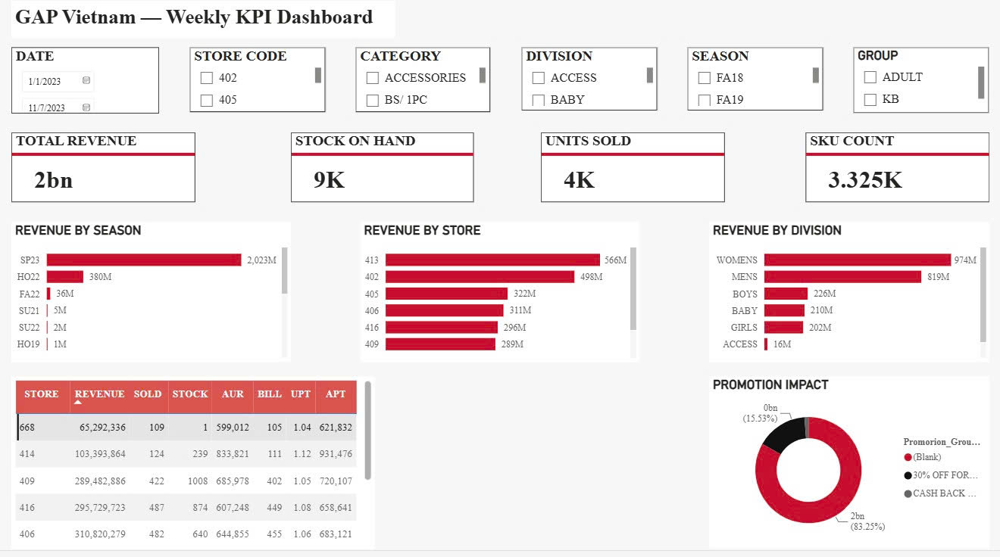

# GAP Vietnam — Weekly KPI Dashboard

## Overview

Business Intelligence Dashboard for monitoring sales performance, inventory and promotion effectiveness across GAP Vietnam stores.

---

## Business Problem

- Monitor weekly sales performance
- Track inventory and SKU movement
- Evaluate promotion effectiveness
- Support management decision making

---

## Tech Stack

- SQL Server
- Power BI
- DAX
- Microsoft Fabric

---

## Key Metrics

- Revenue
- Stock On Hand
- Unit Sold
- SKU Count
- AUR
- Bill Count
- UPT
- APT

---

## Dashboard Preview

---

## Business Value

- Centralized KPI reporting across stores.
- Compare store performance and inventory efficiency.
- Monitor promotion impact on revenue.
- Support data-driven business decisions.

---

## Author

**Nguyễn Hoài Thu**

Data Analyst | Business Intelligence
